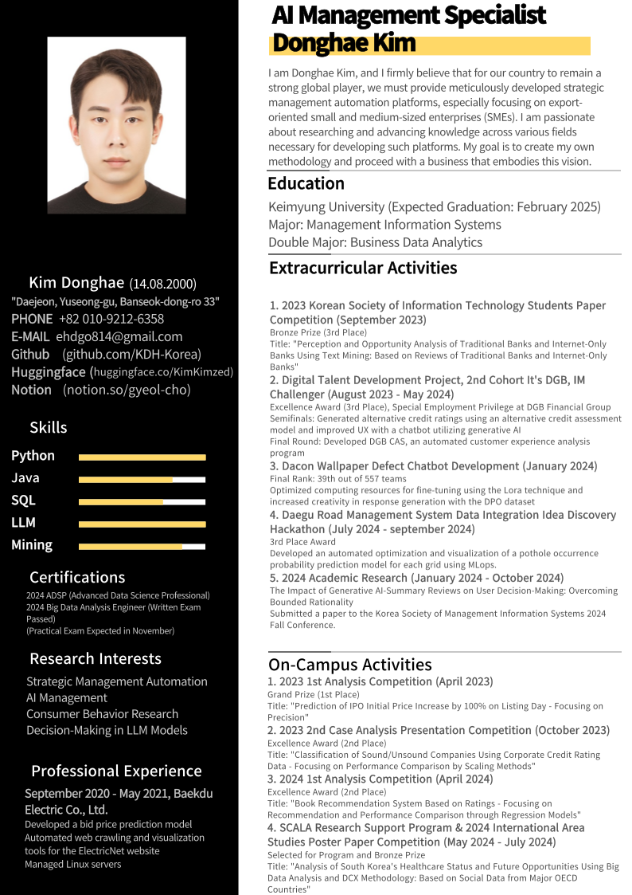

# 1. 기본 정보

- **이름**: 김동해
- **소속 대학**: 계명대학교
- **소속 학과**: 주전공(경영정보), 부전공(비즈니스데이터분석)
- **나이**: 25살(2000.08.14일 생)
- **군복무**: 육군 병장 만기 전역
- **전화번호**: 010-9212-6358
- **이메일**: ehdgo814@gmail.com
- **허깅페이스**: [huggingface.co/KimKimzed](https://huggingface.co/KimKimzed)
- **깃허브**: [github.com/KDH-Korea](https://github.com/KDH-Korea)
- **학술 동아리 노션**(결초보은): [www.notion.so/gyeol-cho](https://www.notion.so/gyeol-cho/0f69403686b74927a98cf7252db18583?pvs=4)

# 2. 자기소개

안녕하십니까. Ai와 빅데이터 기술을 이용해 전략경영과 AI경영을 하고 싶은 김동해입니다. 진부한 이야기일지 모르지만 저에게는 대한민국이라는 나라를 더욱 강하게 만들고 싶은 꿈이 있습니다.

대한민국은 국내총생산(GDP) 기준으로 세계 15위권에 위치한 경제 강국입니다. 하지만 다른 선진국들과 비교했을 때, 내수시장에 대한 의존도와 함께 수출 의존도 역시 상당히 높은 편입니다. 내수시장을 확대하여 경쟁력을 높이는 방법도 있지만, 저출산과 인구 감소로 인해 내수시장의 성장은 한계에 봉착해 있습니다. 따라서, 국가 경제의 지속 가능한 발전을 위해 수출 역량의 강화를 더욱 중점적으로 추진해야 한다고 생각합니다.

현재 대한민국의 수출 중 약 70%는 대기업에 의해 이루어지고 있습니다. 그러나 수출기업의 수로 보면 약 92,000개의 기업 중 97%가 중소기업입니다. 중소기업들은 기술력 부족 같이 핵심 업무 능력 요인을 제외한다면, 자금 조달, 인력 확보, 경영 능력 부족, 판로 확보 등 경영 전반적인 문제로 인해 성장의 기회를 놓치고 있는 상황입니다.

이러한 문제를 해결하고 대한민국의 수출 경쟁력을 강화하기 위해서는 수출 중소기업의 글로벌 경쟁력 제고가 필수적입니다. 저는 이를 **전략경영 자동화 플랫폼**을 통해 실현하고자 하는 목표를 가지고 있습니다.

오늘날 국가의 경계가 점차 희미해지고 있는 시대에, 이러한 꿈은 다소 시대를 거스르는 것처럼 보일 수 있습니다. 그러나 이 문제를 해결할 수 있다면 대한민국의 경제는 한층 더 발전할 수 있으며, 자본주의 체제가 유지되는 한 국민 모두의 삶의 질 또한 향상될 것이라고 믿습니다.

이러한 꿈을 위해 지금까지 무엇을 해왔는지, 앞으로 어떤 연구를 하고 싶고, 현재 무엇을 할 수 있는지, 왜 AI와 빅데이터여만 하는지 등을 카테고리에 따라 서술하도록 하겠습니다.
## 자기소개 요약
1. 전략경영 자동화 플랫폼 사업을 할 것이다. 왜냐하면
2. 우리나라는 gdp중 수출의 비율이 높다.
3. 내수시장은 출산율 감소에 따라 꾸준히 감소할 것이다.
4. 수출시장중 중소기업이 숫자로 97%를 차지한다.
5. 중소기업의 세계무대 경쟁력 강화가 필수이다.
6. 그러나 지원업무 중 경영관련 문제가 많다.
7. 이를 전략경영 자동화 플랫폼을 통해 해결한다.

# 3. 경력 및 활동
## 3-1. 실무 경력
### (주)백두전력 (20년 9월~21년 5월)
- 데이터 분석을 통한 입찰 가격 예측 모델 개발
- 전기넷 홈페이지 크롤링 자동화 및 시각화 툴 개발
- 리눅스 서버 관리
### 빅웨이브에이아이(24년 7월~현재 진행중)
- 대구 매개체감염병 취약지역 분석 (대구시 외주)
	->시각화 툴 제작, 방역 민원 예측 모델 개발, 분석 결과 보고서 제작

## 3-2. 동아리 활동
- 동아리 이름: 결초보은
- 활동기간: 23년 1월 ~ 현재 진행 중
- 동아리 성격: 빅데이터 분석 학술 동아리, 활동 도중 비영리 단체로 전환
- 가입 동기: 전역 후 꿈을 이루기 위해서 데이터 사이언스가 필수지만 관련 지식이 부족하다고 생각하여 전문적으로 배우며 의견을 나누기 위해 동아리 가입
### 활동 내역
#### 총무, 부회장 연임
#### 동아리 노션 제작
#### 동아리 깃허브 제작
#### 동아리 비영리 단체 전환 계획 및 성공
#### 신입교육 두분기마다 총 3회 진행
#### 매달 인문학 도서와 과학 도서의 공통점 찾기 대회 실시
- 1회 국부론과 소나기의 공통점 찾기 대회
- 수동적 감정을 중심으로 생각한 국부론과 소나기의 공통점
- 어떠한 행위를 '하기 위한' 판단의 잣대로 사용하는 감정이 아닌, 판단의 잣대로 '사용되는' 감정들이 더 큰 효과를 불러온다는 공통점 발견
- 소셜 데이터 감성 분석을 진행할 때 기존의 긍부정 척도에서 arousal 값이 포함된 emotion analysis를 해야 더욱 유의미한 인사이트가 도출된다는 생각을 해 이후 연구에 적용 
#### 모든 교외 활동 및 교내 활동을 동아리 사람들과 함께 진행

## 3-3. 교외활동
### 1. 23년 DIP 분석 경진대회
- 활동기간: 23년 6월 ~ 23년 8월
- 주제: 관광지 리뷰와 소비 데이터를 활용한 대구시 관광객 유형별 특성 분석 및 관광지 마케팅 전략 수립
- 리뷰데이터와 정형데이터의 멀티 모달을 통한 예측모델 제작
### 2. 23년 빅콘테스트 
- 활동기간: 23년 7월 ~ 23년 9월 
- 주제: 상업용 부동산 가치 창출을 위한 소상공인 매출등급 예측모형 제작 및 활용방안 제시
- 스태킹과 OOF방식을 통한 모델 제작으로 성능 향상
### **3. 디지털 인재 양성 프로젝트 2기 IT's DGB, IM Challenger**
- 활동기간: 23년 8월 ~ 24년 5월
- 본선, 전문교육, final round 총 10개월에 걸치며 활동 진행
- 본선: 대체신용평가 모델을 통한 대체신용등급 생성 및 생성형 ai를 활용한 챗봇으로 UX 개선
- final round: 고객경험분석 자동화 프로그램 DGB CAS 제작
- **우수상(3등), DGB 금융지주 취업특전(필기, 서류 면제)**
### **4. 23년 한국정보 기술학회 대학생 논문 경진대회**
- 활동기간: 23년 6월 ~ 23년 11월
- 주제: 텍스트 마이닝을 활용한 시중 은행과 인터넷 전문은행에 대한 인식 및 기회 분석 - 시중은행 및 인터넷 전문은행에 대한 리뷰를 바탕으로
- **동상**
### 5. 데이콘 - 대구 교통사고 피해예측 AI 경진대회
- 활동기간: 23년 12월
- 특이사항: 딥러닝 모델의 변수별 가중치를 달리하는 레이어 추가를 통한 모델 성능 향상
- 85등 - 총 941팀
### **6. 데이콘 - 도배하자 챗봇 개발 경진대회**
- **활동기간: 24년 1월**
- **특이사항: Lora 기법을 활용한 파인튜닝, 요구 컴퓨팅 리소스 최적화 및 DPO 데이터셋을 통한 답변 생성의 창의성 증가**
- **70등 - 총 557팀**
### 7. 제3회 고용노동 공공데이터 활용 공모전
- 활동기간: 24년 3월~ 24년 7월
- 주제: NCS 직무기술서를 바탕으로 직무 추천 및 채용공고 추천 시스템 – CUX 기반의 쌍방향 인터렉션 챗봇을 중심으로
### 8. 24년 공공데이터 활용 도로관리 효율화 해커톤
- 활동기간: 24년 7월 ~ 현재 진행중
- 주제: MLOps를 이용한 그리드별 포트홀 발생확률 예측 모델 자동 최적화 및 시각화
- 본선 진출, 본선 5팀
### 9. 24년 학술 연구 (24년 1월~ 현재 진행중,학회 미지정)
- 다음 주제들 중 연구 구체화중
- 시끄러운 소수 조용한 다수의 온라인 세계에서의 불균형 현상
- 개인의 온라인 세상과 실제 세상의 페르소나는 다를 수 있다
- 다크 패턴을 활용한 수익 창출 전략
- 맥락인식 프레임워크 및 레이어 추가에 따른 LLM모델의 목적 지향성 의사결정 완화

## 3-4. 교내활동
### 1. 23년 1차 분석 경진대회
- 활동기간: 23년 4월
- 공모주 공모가 상장일 시초가 100% 향상 예측 - 정밀도를 중심으로 
- **최우수상(1등)**
### 2. 23년 2차 사례분석 발표대회
- 활동기간: 23년 10월
- 기업의 신용등급 데이터를 활용한 우량/불량 기업 분류 - 스케일링 방법에 따른 성능 비교를 중심으로
- **우수상(2등)**
### 3. 24년 1차 분석 경진대회
- 활동기간: 24년 4월
- 평점 기반 도서 추천시스템 - 회귀 모델을 통한 추천과 성능 비교를 중심으로
- **우수상(2등)**
### 4. 의대 랩실 연구단 지원 
- 활동기간: 24년 4월 ~ 24년 5월
- 의대 ai 연구실에서 머신러닝 모델 개발 지원 요청
- 지원 요청에 따라 머신러닝 예측 모델 제작 및 통계검증 도움
### 5. 스칼라 논문 지원 프로그램 및 24년 국제 지역학 포스터 논문대회
- 활동기간: 24년5월 ~ 24년 7월
- 빅데이터 분석과 DCX 방법론을 통한 대한민국 의료 현황 분석 및 향후 기회 포착: OECD주요 국가의 소셜 데이터를 바탕으로 
- **프로그램 선별 및 동상**

## 3-5. 군대 (21년 5월 ~ 22년 11월)
- 엑셀을 통한 총기 수불 자동화 프로그램 제작
- 엑셀을 통한 탄약 수불 자동화 프로그램 제작 
-> 우리나라 발전을 위해 큰 힘이 되고 싶다는 목표 설정

## 3-6. 자격증
ADSP(데이터 분석 준 전문가)
빅데이터 분석 기사(필기, 실기 11월 중 취득 예정)

# 4. 연구 희망 주제

- 온라인 세계에서 시끄러운 소수와, 조용한 다수 – 온라인 세계 재정의
- 생성형 AI의 소비자 및 기업 영향(요약, 챗봇, 추천시스템 등)
- 진정한 사용자를 나타내는 데이터는 무엇인가. 리뷰(텍스트,소셜) 데이터 vs 로그 데이터
- 웹 환경에서 다크패턴을 통해 수익 창출 전략
- LLM을 활용한 자동화시 문제점 -> (AI sub goal 문제)
- LLM을 활용한 경영전략 도출 자동화
- 데이터셋의 편향에 따른 AI 모델의 불균형
- 사용자 경험 개선을 위한 AI 기반 인터페이스 개발

# 5. Skill 및 도메인
## 코딩 skill

### 언어
- python
- java
- SQL
### 머신러닝 및 딥러닝 엔지니어링
- **Scikit-learn**: 회귀, 분류, 클러스터링 알고리즘 구현
- **TensorFlow, Keras**: 딥러닝 모델 설계 및 신경망 구성
- **PyTorch**: 고급 딥러닝 모델 구현 및 연구 개발
- **huggingface**: 각종 라이브러리를 통해 작업 간소화
- XGB, LGBM, CatBoost 등 다양한 모델 사용 가능
- 스태킹, OOf 등 각종 성능 향상 기법 구현 가능

### 자동화 및 배포 도구
- **Docker, Kubernetes**: 모델 배포 및 컨테이너화
- **Airflow**: 데이터 파이프라인 자동화 및 워크플로우 관리
- **FastAPI, Flask**: 머신러닝 모델 API 개발 및 배포

### 데이터 처리 및 시각화
- **Pandas, Numpy**: 데이터 처리 및 분석
- **Matplotlib, Seaborn, Plotly**: 데이터 시각화 및 대시보드 제작
- **Tableau**: 태블로를 통한 데이터 시각화 대시보드 제작

### 클라우드 및 협업 도구
- **AWS, Google Cloud platform**: 클라우드 환경에서의 머신러닝 모델 및 챗봇 시스템 운영
- **Git, GitHub**: 코드 버전 관리 및 협업

### LLM
- **Transformers(Hugging Face)**: GPT, BERT 등 사전학습 모델 활용 및 파인튜닝
- **LoRA(Low-Rank Adaptation)**: 경량 파인튜닝을 통한 LLM 최적화
- **PEFT(Parameters-Efficient Fine-Tuning)**: 효율적인 대규모 언어 모델 파인튜닝
- **DPO(Direct Preference Optimization)**: 답변 생성 품질 향상을 위한 데이터셋 활용
- **프롬프트 엔지니어링**
- **Lang Chain**
- **RAG**

## 관심 도메인
- AI 경영
- UX(소비자 및 사용자 경험)
- HAI
- LLM
- AI(AI 기술 도입 등)에 따른 영향 및 영향 설명
- 소셜 데이터
- 데이터 사이언스, 머신러닝, AI, 추천시스템, XAI 등